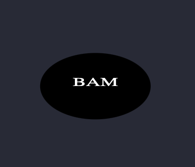

# SVG-Logo-Maker

A command line SVG logo maker app

## Upcoming Iterations

n/a

## Image of a generated SVG

Image: 

## A video walk through

Video: https://drive.google.com/file/d/1vm9FPZYM1AM9k4crKCm8Jq-EgOrYbJfh/view

## Repo:

https://github.com/fswDevSteph/SVG-Logo-Maker

## Installation instructions:

You will need node and jest to run this

## Contributers

Tutors, Class assitance and other classmates - .
Tutors: Names unknown
Classmate: Sam Allen

## Known Issues:

N/A

## About Developer:

Stephanie Perroni is a full stack software development student who hopes to make meaningful and positively impactful contributions in the software development space.
